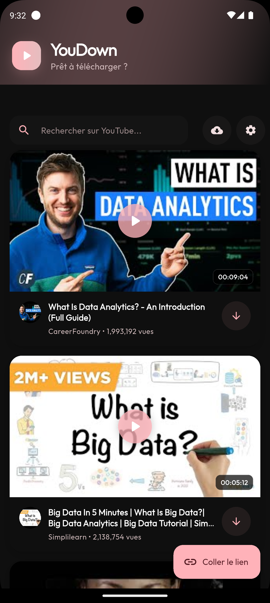
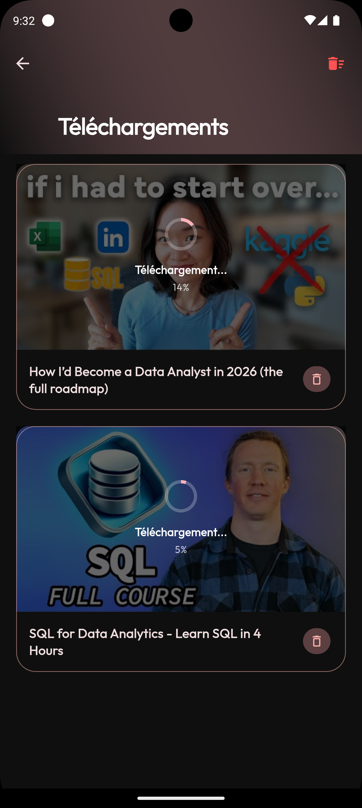
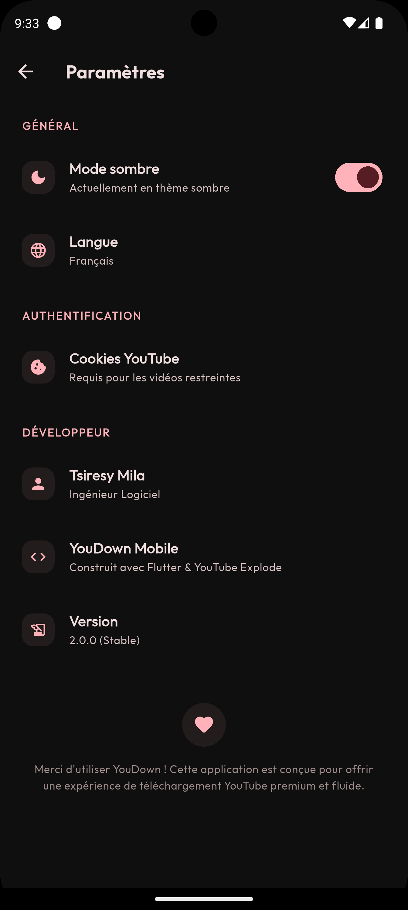

# YouDown Mobile 📱

A premium, open-source YouTube downloader built with Flutter.

  
  
  
  

## Features ✨

- **High-Quality Downloads**: Support for 4K video downloads.
- **Audio Extraction**: Convert videos to high-quality MP3s instantly.
- **Background Service**: Downloads continue even when the app is closed.
- **Background Playback**: Listen to your downloaded audio/video content with screen off.
- **Material 3 Design**: A modern, slick interface with dark mode support.
- **Multi-Language**: Available in English and French.

## Getting Started 🚀

This project uses [FFmpeg](https://ffmpeg.org/) for media processing.

1. Clone the repo
2. Run `flutter pub get`
3. Run `flutter run`

## Tech Stack 🛠️

- **Framework**: Flutter
- **State Management**: Bloc / Hydrated Bloc
- **Navigation**: GoRouter
- **Media Processing**: FFmpeg Kit
- **YouTube API**: Youtube Explode
- **Local Storage**: Hive / Shared Preferences

## License 📄

This project is licensed under the MIT License - see the [LICENSE](LICENSE) file for details.

